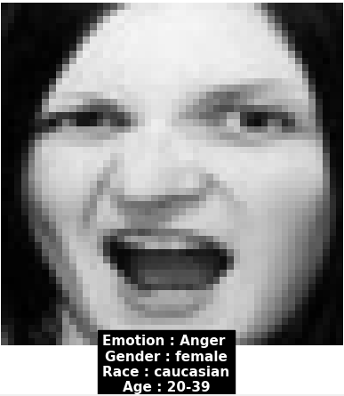
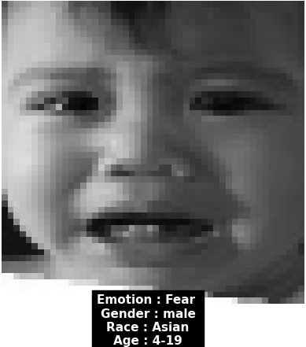
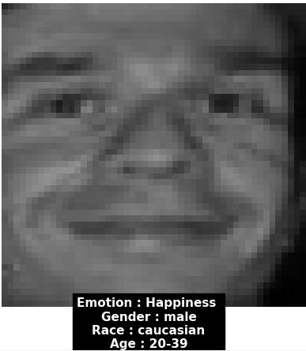
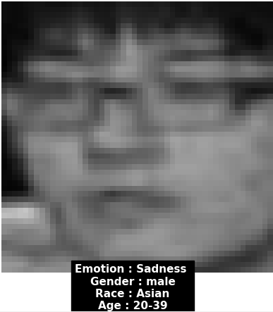
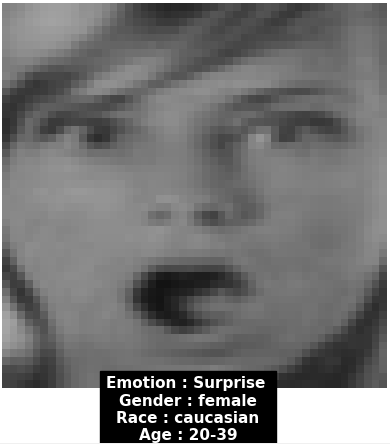
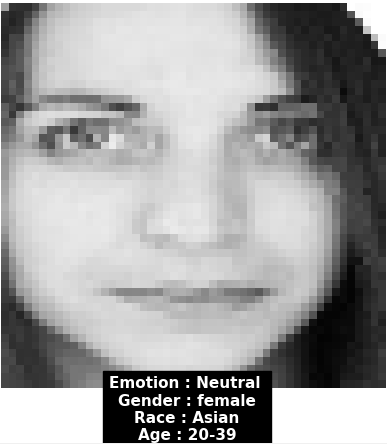

# Multi-task learning for Facial Emotion Recognition
[](https://paperswithcode.com/sota/facial-expression-recognition-on-real-world?p=facial-emotion-recognition-a-multi-task)

This is a official implementation of research paper : [https://arxiv.org/abs/2110.15028](https://arxiv.org/abs/2110.15028)

## Architecture 


## Datasets used 
* [FER2013](https://www.kaggle.com/c/challenges-in-representation-learning-facial-expression-recognition-challenge/data)
* [RAFDB](http://www.whdeng.cn/raf/model1.html)


## Data Preparation

* ### Loading datasets 
#### For RAFDB Dataset 
```python
from utils import load_data

dataset_name = "RAFDB"
X, y = load_data(dataset_name)
```
#### For FER Dataset 
```python
from utils import load_data

dataset_name = "FER"
X, y = load_data(dataset_name)
```

* ### Creating separate categories 

```python
from utils import seperate_category
from sklearn.model_selection import train_test_split

X_train, X_test, y_train, y_test = train_test_split(X, y, train_size=train_size, shuffle=True, random_state=random_state)
ages_train, emotions_train, genders_train, races_train = seperate_category(y_train, dataset_name)
ages_test, emotions_test, genders_test, races_test = seperate_category(y_test, dataset_name)
```

* ### Creating train and valid generators 

```python
train_gen = generate_images(X_train, emotions_train,
                            genders_train, races_train, ages_train, batch_size, True)
valid_gen = generate_images(X_test, emotions_test,
                            genders_test, races_test, ages_test, batch_size, True)
```

## Training 

* ### Loading model

#### To get model pretrained on RAFDB dataset
```python
from model import get_model
dataset_name = "RAFDB"
model = get_model(pretrained=True, dataset_name=dataset_name)
```
#### To get model pretrained on FER dataset
```python
from model import get_model
dataset_name = "FER"
model = get_model(pretrained=True, dataset_name=dataset_name)
```

* ### Model compilation 
```python
metrics = {
    'emotion_output': 'accuracy',
    'age_output': 'accuracy',
    'race_output': 'accuracy',
    'gender_output': 'accuracy'
}
model.compile(
    optimizer=optimizer,
    loss=[

        tf.keras.losses.CategoricalCrossentropy(from_logits=False),
        tf.keras.losses.CategoricalCrossentropy(from_logits=False),
        tf.keras.losses.CategoricalCrossentropy(from_logits=False),
        tf.keras.losses.CategoricalCrossentropy(from_logits=False)
    ],
    loss_weights=[2, 0.1, 1.5,  4, ], # weights for [emotion, gender, race, age]
    metrics=metrics
)
```
* ### How to train

```python
history = model.fit_generator(train_gen,
                              steps_per_epoch=len(y_train)//batch_size,
                              epochs=epochs,
                              callbacks=callbacks,
                              validation_data=valid_gen,
                              validation_steps=len(y_test)//batch_size)
```

* ## Visualize results
```
python visualize.py
```

## Prediction samples 

<p float="left">
  
  
  
</p>

<p float="left">
  
  
  
</p>
